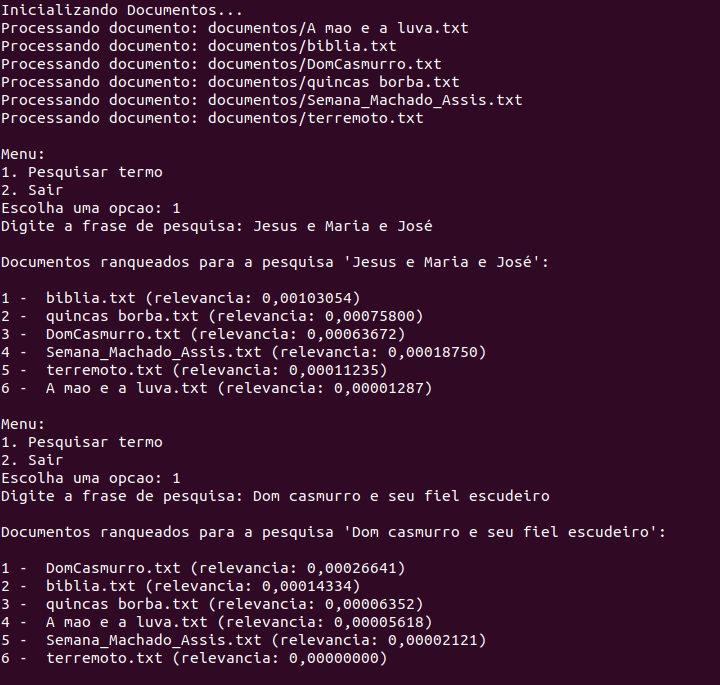

# 📄 Ranqueamento de Documentos

<div align="center">
   
   
   
</div>


<details>
  <summary>📌 Tópicos</summary>
  <ol>
    <li><a href="#-introdução">Introdução</a></li>
    <li><a href="#-estrutura-e-organização-do-projeto">Estrutura e Organização do Projeto
    <li><a href="#-estrutura-de-dados-escolhida">Estruturas de Dados Escolhida</a></li>
    <li><a href="#-alternativas-possíveis">Alternativas Possíveis</a></li>
    <li><a href="#-justificativa-das-escolhas">Justificativa das Escolhas</a></li>
    <li><a href="#-descrição-detalhada-das-operações-implementadas-e-suas-complexidades">Descrição Detalhada das Operações Implementadas e Suas Complexidades</a></li>
    <li><a href="#-cálculos-matemáticos-do-tf-idf">Cálculos Matemáticos do TF-IDF
    <li><a href="#-exemplo-de-entrada-e-saída">Exemplo de Entrada e Saída</a></li>
    <li><a href="#-análise-dos-resultados">Análise dos Resultados</a></li>
    <li><a href="#-discussão-sobre-o-desempenho">Discussão sobre o Desempenho</a></li>
    <li><a href="#-futuras-melhorias">Futuras Melhorias</a></li>
    <li><a href="#-conclusão">Conclusão</a></li>
    <li><a href="#-referência">Referência</a></li>
    <li><a href="#-ambiente-de-compilação">Ambiente de Compilação</a></li>
    <li><a href="#-makefile">MakeFile</a></li>
    <li><a href="#-contato">Contato</a></li>

  </ol>
</details>


## 👋 Introdução 

A crescente disponibilidade de informações em formato digital tem tornado o processo de busca e recuperação de dados um desafio cada vez mais complexo. Com o aumento exponencial da quantidade de documentos disponíveis, torna-se essencial o desenvolvimento de sistemas que possam ranquear eficientemente os documentos com base em sua relevância para termos ou frases de pesquisa específicas. Nesse contexto, o algoritmo TF/IDF (Term Frequency - Inverse Document Frequency) surge como uma ferramenta amplamente utilizada para medir a relevância de documentos em relação a uma consulta, analisando tanto a frequência dos termos dentro de um documento quanto sua raridade no conjunto de documentos.

Este trabalho tem como objetivo implementar um sistema de ranqueamento de documentos utilizando o algoritmo TF/IDF, aplicando os conceitos estudados na disciplina de Algoritmos e Estrutura de Dados I, como listas, pilhas, filas, métodos de ordenação e tabelas hash. 


## 🗂️ Estrutura e Organização do Projeto

A estrutura do projeto está organizada da seguinte forma:

- **config.h**: Define configurações globais, como o diretório `documentos/` onde estão armazenados os arquivos de texto e stop words.
- **documento.c e documento.h**: Responsáveis pelo processamento de documentos e pelo cálculo da relevância de termos usando TF/IDF.
- **fila.c e fila.h**: Implementam uma fila para armazenamento temporário de termos durante o processamento.
- **tabela_hash.c e tabela_hash.h**: Implementam uma tabela hash para armazenamento e recuperação rápida da frequência de termos em documentos.
- **main.c**: Arquivo principal que executa o fluxo do programa, desde a leitura e processamento dos documentos até o ranqueamento final dos mesmos.

## 📂 Estrutura de Dados Escolhida

1. **Fila**:
   - **Descrição**: Armazena os termos presentes em cada documento durante a leitura e processamento.
   - **Justificativa**: Eficiência para armazenar e processar termos na ordem de chegada (complexidade `O(1)`).
   
2. **Tabela Hash**:
   - **Descrição**: Armazena a frequência de cada termo para cálculo de TF/IDF.
   - **Justificativa**: Acesso rápido com complexidade `O(1)`, essencial para grandes volumes de dados textuais.

3. **QuickSort**:
   - **Descrição**: Ordena os documentos por relevância.
   - **Justificativa**: Algoritmo eficiente (`O(n log n)`) para ordenação, adequado para ranqueamento dos documentos.

---

### 🔍 Alternativas Possíveis

1. **Lista Ligada** - Permite inserções e remoções eficientes, mas a busca tem complexidade `O(n)`.
2. **Árvore Binária de Busca (BST)** - Busca, inserção e remoção com complexidade média de `O(log n)`, porém pode degradar para `O(n)` em casos de desbalanceamento.
3. **Árvore AVL** - Garante `O(log n)` para operações principais, mas a implementação é mais complexa.

---

### 🔍 Justificativa das Escolhas

- **Fila**: Escolhida pela simplicidade e eficiência na inserção e remoção de termos durante o processamento dos documentos.
- **Tabela Hash**: Escolhida pela eficiência no acesso e manipulação dos termos, permitindo cálculos rápidos de TF/IDF.
- **QuickSort**: Escolhido pela eficiência na ordenação dos documentos com base na relevância, garantindo um desempenho adequado para o ranqueamento.


## 📝 Descrição Detalhada das Operações Implementadas e Suas Complexidades

1. **Leitura e Processamento dos Documentos**  
   **Função:** `processarDocumento`  
   - **Descrição:** Lê um documento, normaliza os termos (removendo pontuação, convertendo para minúsculas e removendo stop words) e armazena os termos em uma tabela hash.  
   - **Complexidade:** O(n), onde n é o número de termos no documento. A leitura e normalização de cada termo é O(1), e a inserção na tabela hash é O(1) em média.

2. **Normalização de Termos**  
   **Função:** `processarTermo`  
   - **Descrição:** Remove pontuação, converte para minúsculas e mantém apenas letras e caracteres acentuados.  
   - **Complexidade:** O(m), onde m é o comprimento do termo.

3. **Verificação de Stop Words**  
   **Função:** `eStopword`  
   - **Descrição:** Verifica se um termo é uma stop word.  
   - **Complexidade:** O(k), onde k é o número de stop words.

4. **Carregamento de Stop Words**  
   **Função:** `carregarStopwords`  
   - **Descrição:** Carrega as stop words de um arquivo.  
   - **Complexidade:** O(k), onde k é o número de stop words.

5. **Inserção na Tabela Hash**  
   **Função:** `inserirTermoTabelaHash`  
   - **Descrição:** Insere um termo na tabela hash, redimensionando a tabela se necessário.  
   - **Complexidade:** O(1) em média para inserção, O(n) para redimensionamento, onde n é o número de termos na tabela.

6. **Busca na Tabela Hash**  
   **Função:** `buscarTermoTabelaHash`  
   - **Descrição:** Busca um termo na tabela hash.  
   - **Complexidade:** O(1) em média.

7. **Cálculo do IDF**  
   **Função:** `calcularIDF`  
   - **Descrição:** Calcula o Inverse Document Frequency (IDF) de um termo.  
   - **Complexidade:** O(1).

8. **Cálculo do TF/IDF**  
   **Função:** `calcularTFIDF`  
   - **Descrição:** Calcula o Term Frequency-Inverse Document Frequency (TF-IDF) para cada termo em cada documento.  
   - **Complexidade:** O(n * m), onde n é o número de documentos e m é o número de termos em cada documento.

9. **Cálculo da Relevância do Documento**  
   **Função:** `calcularRelevanciaDocumento`  
   - **Descrição:** Calcula a relevância de um documento para uma consulta, somando os valores de TF/IDF dos termos que aparecem na consulta.  
   - **Complexidade:** O(m), onde m é o número de termos na consulta.

10. **Ordenação dos Documentos**  
    **Função:** `ordenaDocumentosQuickSort`  
    - **Descrição:** Ordena os documentos de acordo com a relevância usando o algoritmo QuickSort.  
    - **Complexidade:** O(n log n) em média, onde n é o número de documentos.

11. **Ranqueamento dos Documentos**  
    **Função:** `ranquearDocumentos`  
    - **Descrição:** Calcula a relevância de cada documento para uma consulta e ordena os documentos de acordo com a relevância.  
    - **Complexidade:** O(n * m + n log n), onde n é o número de documentos e m é o número de termos na consulta.


## Cálculos Matemáticos do TF-IDF

Para ranquear a relevância dos documentos, o código utiliza o cálculo de TF-IDF (Term Frequency-Inverse Document Frequency). Este cálculo é dividido em duas partes:

1. **TF (Frequência do Termo)**: Mede a frequência de um termo em um documento específico.
   
   - **Fórmula**: 

   TF_termo = (Número de vezes que o termo aparece no documento) / (Número total de termos no documento)


2. **IDF (Frequência Inversa do Documento)**: Mede a importância de um termo em relação ao conjunto total de documentos. A ideia é reduzir o peso de termos que aparecem em muitos documentos, pois são menos específicos.

   - **Fórmula**:

   IDF_termo = log(Número total de documentos / Número de documentos que contêm o termo)


3. **TF-IDF**: Combina o TF e o IDF para dar um peso maior a termos frequentes em um documento específico, mas raros em outros documentos. Este valor representa a importância do termo no contexto do documento e da coleção de documentos.

   - **Fórmula**:
   
   TF-IDF_termo = TF_termo * IDF_termo

---


### Implementação

O código calcula esses valores para cada termo nos documentos, armazenando o TF-IDF de cada termo na estrutura de dados `TabelaHash`. Em seguida, é possível calcular a relevância de cada documento em relação a uma consulta ao somar os valores de TF-IDF dos termos da consulta presentes no documento. Essa relevância é utilizada para ranquear os documentos conforme a consulta.

Essas operações são realizadas nas funções do código, onde:
- `calcularIDF` calcula a IDF.
- `calcularTFIDF` armazena o TF-IDF dos termos.
- `calcularRelevanciaDocumento` calcula a relevância total para ranqueamento.


## 💡 Exemplo de Entrada e Saída

### Exemplo 1
**Entrada**: Jesus e Maria e José  
**Saída**:  
```
1 - biblia.txt (relevancia: 0.00103054)
2 - quincas borba.txt (relevancia: 0.00075800)
3 -  DomCasmurro.txt (relevancia: 0.00063672)
4 -  Semana_Machado_Assis.txt (relevancia: 0.00018750)
5 -  terremoto.txt (relevancia: 0.00011235)
6 -  A mao e a luva.txt (relevancia: 0.00001287)
...
```
### Exemplo 2
**Entrada**: Dom casmurro e seu fiel escudeiro

**Saída**:  
```
1 -  DomCasmurro.txt (relevancia: 0.00026641)
2 -  biblia.txt (relevancia: 0.00014334)
3 -  quincas borba.txt (relevancia: 0.00006352)
4 -  A mao e a luva.txt (relevancia: 0.00005618)
5 -  Semana_Machado_Assis.txt (relevancia: 0.00002121)
6 -  terremoto.txt (relevancia: 0.00000000)
...
```

### Exemplo 3
**Entrada**: Estevão de a Mão e a Luva

**Saída**:  
```
1 -  A mao e a luva.txt (relevancia: 0.00631478)
2 -  biblia.txt (relevancia: 0.00040904)
3 -  quincas borba.txt (relevancia: 0.00032492)
4 -  DomCasmurro.txt (relevancia: 0.00023513)
5 -  Semana_Machado_Assis.txt (relevancia: 0.00008710)
6 -  terremoto.txt (relevancia: 0.00000000)
...
```

### Exemplo 4
**Entrada**: Terremoto do vulcão na montanha

**Saída**:  
```
1 -  terremoto.txt (relevancia: 0.00294291)
2 -  Semana_Machado_Assis.txt (relevancia: 0.00006371)
3 -  quincas borba.txt (relevancia: 0.00002812)
4 -  biblia.txt (relevancia: 0.00002809)
5 -  DomCasmurro.txt (relevancia: 0.00002119)
6 -  A mao e a luva.txt (relevancia: 0.00000000)
...
```

### Exemplo 5
**Entrada**: Rubião e Quincas Borba

**Saída**:  
```
1 -  quincas borba.txt (relevancia: 0.02313679)
2 -  terremoto.txt (relevancia: 0.00000000)
3 -  biblia.txt (relevancia: 0.00000000)
4 -  DomCasmurro.txt (relevancia: 0.00000000)
5 -  A mao e a luva.txt (relevancia: 0.00000000)
6 -  Semana_Machado_Assis.txt (relevancia: 0.00000000)
...
```

## 📊 Análise dos Resultados

Após o desenvolvimento, foram adicionados métricas para avaliar o consumo de memória e o tempo de processamento da aplicação. A imagem abaixo retrata as saídas de uma pesquisa e em seguida, uma discussão sobre os resultados.



#### 1. Processamento dos Documentos

- **⏱️ Tempo de Execução**:
  - Varia de **0.004 segundos a 0.658 segundos**, dependendo do tamanho do documento.
  - Documentos maiores, como `"biblia.txt"`, têm um tempo de processamento maior.

- **🧠 Uso de Memória**:
  - O uso de memória estimado para a tabela hash varia de **0.10 MB a 3.45 MB**.
  - Documentos com mais termos exigem mais memória para armazenamento da tabela hash.

#### 2. Cálculo do TF/IDF

- **⏱️ Tempo de Execução**:
  - O cálculo total de TF/IDF levou **0.057 segundos**.
  - O tempo é considerado eficiente, dado o número de termos processados.

#### 3. Pesquisa e Ranqueamento

- **⏱️ Tempo de Execução**:
  - O tempo de execução para relevância e ordenação foi **insignificante (0.000 segundos)**.
  - Indica que o sistema é altamente eficiente para consultas rápidas.

- **🧠 Uso de Memória**:
  - O uso de memória estimado para os documentos foi de **0.003 MB**.
  - Isso é esperado, já que são armazenadas apenas informações básicas de cada documento.


---


### 📈 Discussão sobre o Desempenho

#### Tempo de Execução
- **Leitura e Processamento dos Documentos**:
  - O tempo de execução é proporcional ao tamanho do documento.
  - Documentos maiores levam mais tempo para serem processados, o que é esperado.
- **Cálculo do TFIDF**:
  - O tempo de execução é eficiente, considerando o número de termos processados.
  - A utilização de tabelas hash ajuda a manter o tempo de execução baixo.
- **Pesquisa e Ranqueamento**:
  - O tempo de execução para consultas é insignificante, indicando que o sistema é muito eficiente para consultas rápidas.
  - A utilização de QuickSort para ordenação garante um desempenho eficiente.

#### Uso de Memória
- **Tabelas Hash**:
  - O uso de memória é proporcional ao número de termos no documento.
  - Documentos maiores requerem mais memória para armazenar a tabela hash.
- **Documentos**:
  - O uso de memória para armazenar informações básicas sobre cada documento é baixo, o que já era esperado.

### 💡 Futuras Melhorias

- **Otimização de Memória**: Implementar estratégias de otimização para reduzir o uso de memória, especialmente em grandes bases de documentos.
- **Estruturas de Dados Alternativas**: Testar estruturas de dados alternativas, como árvores AVL, que poderiam fornecer balanceamento para consultas ainda mais rápidas.
 

## 🏁 Conclusão

Os resultados mostram que o sistema é eficiente tanto em termos de tempo de execução quanto de uso de memória. A utilização de tabelas hash e QuickSort garante um desempenho eficiente para o processamento de documentos e consultas rápidas. No entanto, há espaço para melhorias, especialmente para documentos muito grandes, onde o uso de memória pode ser otimizado. Além disso, seria importante realizar testes com um número maior de documentos, para que fosse possível constatar melhor o tempo de ordenação com uma lista maior de documentos. 

 ## 📚 Referências

Para aprofundamento e embasamento teórico, os seguintes materiais foram consultados:

1. **"Introduction to Information Retrieval"** — *Christopher D. Manning, Prabhakar Raghavan, Hinrich Schütze*. Cambridge University Press, 2008.
   - Este livro oferece uma visão abrangente sobre a recuperação de informações, incluindo o cálculo e aplicação do TF/IDF e técnicas de ranqueamento em sistemas de busca. É uma fonte de referência fundamental para a compreensão teórica e prática de algoritmos de busca e recuperação de documentos.

2. **Tabela de Dispersão (Hash)**:
   - **Michel Pires da Silva, CEFET-MG. "Tabela Hash"**. Slides sobre Tabelas Hash abordando conceitos fundamentais, como funções de hashing, colisões e métodos de endereçamento. Esse material foi utilizado para definir as propriedades de uma tabela hash eficiente no projeto, garantindo acesso rápido aos termos e eficiência em operações de busca e inserção.
[Acesse o slide aqui](https://github.com/mairaallacerda/RanqueamentoDocumentos/blob/main/slides/TabelaDeDispersão.pdf)

3. **Métodos de Ordenação**:
   - **Michel Pires da Silva, CEFET-MG. "Métodos de Ordenação"**. Slides sobre métodos de ordenação que incluem QuickSort, MergeSort e HeapSort. Este material contribuiu para a escolha do QuickSort, garantindo uma ordenação eficiente dos documentos com complexidade média O(n log n) e melhorando o desempenho do ranqueamento de documentos.
[Acesse o slide aqui](https://github.com/mairaallacerda/RanqueamentoDocumentos/blob/main/slides/MétodosDeOrdenação.pdf)


4. **Ranqueamento de Documentos com TF/IDF**:
   - **Michel Pires, CEFET-MG**. Prática de implementação de ranqueamento de documentos com base no algoritmo TF/IDF. O material orienta o desenvolvimento de um sistema de ranqueamento com suporte a frases de pesquisa e leitura de arquivos em massa. Este documento foi usado como guia para implementar o cálculo de TF/IDF e como base para definir os desafios computacionais e discussões sobre o uso de estruturas avançadas, como Árvores AVL e grafos, para melhorar a eficiência.
[Acesse o slide aqui](https://github.com/mairaallacerda/RanqueamentoDocumentos/blob/main/slides/TF-IDF.pdf)


5. **Estruturas de Dados Básicas**:
   - **Michel Pires da Silva, CEFET-MG. "Estruturas Básicas"**. Slides abordando as estruturas de dados fundamentais, incluindo listas, pilhas e filas, com ênfase em seus usos e complexidades. Esses conceitos serviram como base para a escolha e implementação das estruturas de dados no projeto, garantindo uma modelagem eficiente dos dados e operações.
   [Acesse o slide aqui](https://github.com/mairaallacerda/RanqueamentoDocumentos/blob/main/slides/EstruturasBásicas.pdf)


6. **Estruturas de Dados por Apontador**:
   - **Michel Pires da Silva, CEFET-MG. "Estruturas de Dados por Apontador"**. Apresenta as particularidades das estruturas de dados baseadas em ponteiros, como listas, pilhas e filas por apontador. Este material foi utilizado para a implementação de estruturas dinâmicas, facilitando operações eficientes e flexíveis em memória para o ranqueamento de documentos.
   [Acesse o slide aqui](https://github.com/mairaallacerda/RanqueamentoDocumentos/blob/main/slides/EstruturasDadosApontador.pdf)


## 🔨 Ambiente de Compilação

A seguir estão os detalhes do ambiente de compilação onde o programa foi executado:

| Componente           | Detalhes                                  |
|----------------------|-------------------------------------------|
| Sistema Operacional  | Ubuntu 22.04.4 LTS - 64 bits              |
| Modelo do hardware   | Lenovo Ideapad 3                          |
| Processador          | AMD® Ryzen 7 5700u                        |
| Memória RAM          | 8 GB                                      |
| Armazenamento        | 512 GB SSD                                |
| IDE                  | Visual Studio Code                        |


## ⛏ Makefile

O Makefile é um utilitário que automatiza o processo de compilação e execução de programas. Aqui estão os principais comandos do Makefile para este projeto:

| Comando      | Descrição                               |
|--------------|-----------------------------------------|
| `make`       | Compila o programa.                     |
| `make run`   | Executa o programa com o arquivo de entrada fornecido. |
| `make clean` | Remove os arquivos compilados.          |


## 📧 Contato

Para mais informações ou sugestões, sinta-se à vontade para entrar em contato:

- ✉️ **E-mail**: [](mailto:mairaallacerda@gmail.com)
- 📸 **Instagram**: [](https://www.instagram.com/mairaallacerda/)


